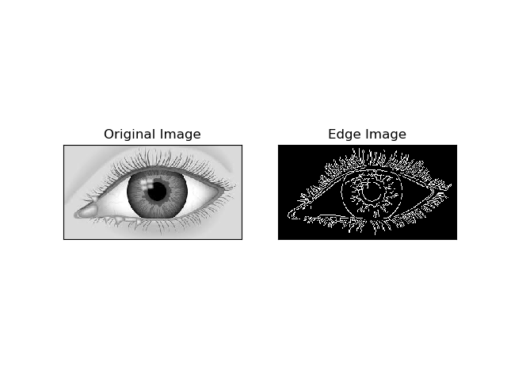

## Code Challenge
Create a page or tool which performs edge detection on a given image and, given a point, returns the distance from that point to the closest edge.

### Approach
1) Converting the image to Grayscale image .                                                                                                               2) Canny edge detection using OpenCV inbuilt function cv2.canny()                                                                                                      3) Performing BFS in the input image matrix and storing the distance of nearest edge for every cell of input image matrix in result matrix.                                                                                                                                                  4) Ask the user for input(x-coordinate and y-coordinate of the cell)                                                                                                            5) Output the least distance of edge from the coordinates specified by the user.   

